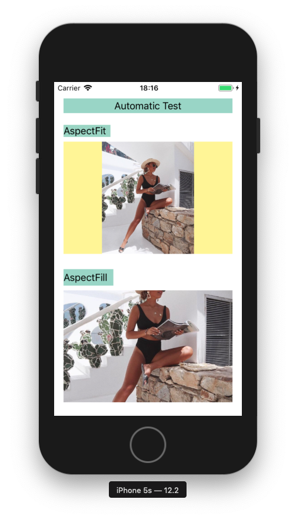
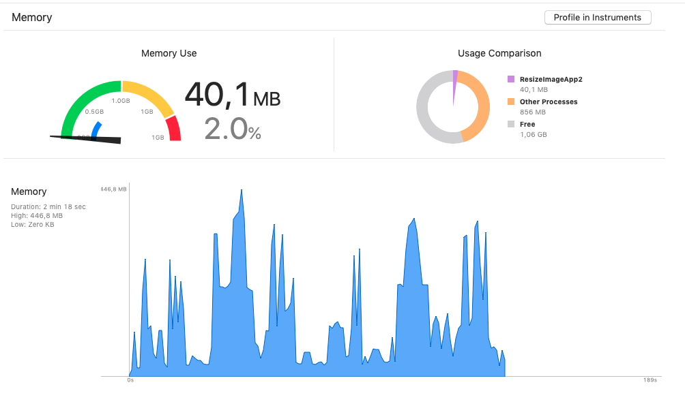

## Содержание

- [📖 Введение в проблематеку](#введение-в-проблематеку)

- [📚 Перечисление основных технологий](#перечисление-основных-технологий)

- [📈 Результаты тестов](#результаты-тестов)

- [👀 Интересные факты](#интересные-факты)

- [‼️ Важные особенности](#важные-особенности)

- [📋 Описание тестового проекта](#описание-тестового-проекта)

- [💻 Сниппеты кода](#сниппеты-кода)

  - [Objective-c](#objective-c)

    - [UIKit](#uikit-objc)

    - [CoreGraphics](#coregraphics-objc)

    - [ImageIO](#imageio-objc)

    - [CoreImage](#coreimage-objc)

    - [vImage](#vimage-objc)

  - [Swift](#swift)

    - [UIKit](#uikit-swift)

    - [CoreGraphics](#coregraphics-swift)

    - [ImageIO](#imageio-swift)

    - [CoreImage](#coreimage-swift)

    - [vImage](#vimage-swift)

- [📦 Дополнительные материалы](#дополнительные-материалы)

<br>

## Введение в проблематеку

<br>
Когда вы скачиваете некую картинку из интернета и пытаетесь вставить ее в `UIImageView` вы можете встретиться со следующей проблемой.
Что-бы отобразить картинку в экземпляре `UIImageView` операционная система для этого берет оригинальные `UIImage` и сжимает его до разрежения `UIImageView`.



Во время выполнения этой операции производительность устройства может снизиться, с **60FPS** до **15-20FPS**.

Поэтому перед каждым разработчиком стоит обязанность самостоятельно сжимать картинку перед вставкой в `UIImageView`.



<br>
<br>
<br>

## Перечисление основных технологий

Процедуру сжатия можно выполнить разными технологиями, всего их 5.

**UIKit** <br>
**CoreGraphics** <br>
**ImageIO** <br>
**CoreImage** <br>
**vImage** <br>

Данный репозиторий содержит проект с кодом для каждой из технологий сразу на двух языках `Swift`/`Objective-c`.
<br>
<br>

## Результаты тестов

Перед тем как написать собственные тест, я прочитал статью на [NSHipter](https://nshipster.com/image-resizing/) о сжатии картинок, где также находились Performance Benchmarks.

Когда я проводил собственные тесты я заметил что на разных типах устройств могут быть эффективны разные технологии.

```json
Now the test will be run on device: iPad 2017

Name(Bridge0.4MB) | Size: 0,3 MB | SourceImage: {1920, 1080} | Will converted to: {370, 208}

UIKitObjc                   | AverageTime For : 0.0301
UIKitSwift                  | AverageTime For : 0.0313
CoreGraphicsObjc            | AverageTime For : 0.0064
CoreGraphicsSwift           | AverageTime For : 0.0061
ImageIO_Objc                | AverageTime For : 0.0060
ImageIO_Swift               | AverageTime For : 0.0061
ImageIO_Subsampling_Objc    | AverageTime For : 0.0066
ImageIO_Subsampling_Swift   | AverageTime For : 0.0071
CoreImageObjc               | AverageTime For : 0.0304
CoreImageSwift              | AverageTime For : 0.0293
vImageObjc                  | AverageTime For : 0.0188
vImageSwift                 | AverageTime For : 0.0178
----------------------------------------------------------------------
| The Best Technology: ImageIO_Objc             | Time: 0.0060
----------------------------------------------------------------------
```


## Интересные факты

Также на производительность технологии влияют размер/разрешение/расширение картинки.



Например при редактировании **png** картинок важно разрешение в пикселях, а не размер занимаемой памяти в мегабайтах.
**(То есть первая картинка может весить в 10раз больше второй, но обрабатываться быстрее, потому что имеет меньшее разрешение в пикселях)**.


А для **jpg** картинок важен вес изображения в мегабайтах.
**(То есть первая картинка может иметь разрешение в пикселях больше второй в десятки раз и обрабатываться быстрее, потому что имеет меньше веса в мегабайтах)**.

## Важные особенности

Если вы захотите провести тестирование технологий с собственными картинками вы можете заметить что одна и та же копия картинок (с разными разрешениями) могут более эффективно обрабатываться то одной технологией, то другой.


Я хочу вас предостеречь от написания подобных условий в своих проектах

```objectivec
if (если картинка весит больше 1.2Mb){

     Использовать технологию A
}
 else {
     Использовать технологию B
}
```


⛔️  **Пожалуйста, не делайте этого.** ⛔️

Все подобные тесты производительности очень **индивидуальны**.

Например если вы заметили что изображение которое весит больше N-мегабайтов лучше обрабатывается на N-технологии, это может быть действительно так на каком-то конкретном типе и модели устройства.

Например такое деление может быть эффективным для iPad Air второго поколения, но страшно не эффективно для iPhone 6/6s.
<br>
<br>

## Описание тестового проекта

1. (Контроллер для ручного тестирования) там каждая технология вызывается ровно один раз.
2. (Контроллер для автоматического тестирования) там каждая технология вызывается 5 раз, после чего выводиться среднее время и лучшая технология.

<br>

## Сниппеты кода

### Objective-C

#### UIKit Objc

[Copy code](/Documentation/CodeSnippetsText/objc/uikitobjc.txt)


#### CoreGraphics Objc

[Copy code](/Documentation/CodeSnippetsText/objc/coregraphicsobjc.txt)


#### ImageIO Objc

[Copy code](/Documentation/CodeSnippetsText/objc/imageIOobjc.txt)


#### CoreImage Objc

[Copy code](/Documentation/CodeSnippetsText/objc/coreImageObjc.txt)


#### vImage Objc

[Copy code](/Documentation/CodeSnippetsText/objc/vImageObjc.txt)


---

### Swift

#### UIKit Swift

[Copy code](/Documentation/CodeSnippetsText/swift/uikitswift.txt)


#### CoreGraphics Swift

[Copy code](/Documentation/CodeSnippetsText/swift/coregraphicsswift.txt)


#### ImageIO Swift

[Copy code](/Documentation/CodeSnippetsText/swift/imageIOswift.txt)


#### CoreImage Swift

[Copy code](/Documentation/CodeSnippetsText/swift/coreImageSwift.txt)


#### vImage Swift

[Copy code](/Documentation/CodeSnippetsText/swift/vImageSwift.txt)


<br>

### Дополнительные материалы

https://nshipster.com/image-resizing/ <br>

http://vocaro.com/trevor/blog/2009/10/12/resize-a-uiimage-the-right-way/ <br>

[🇬🇧 English Readme](Readme.md) 
