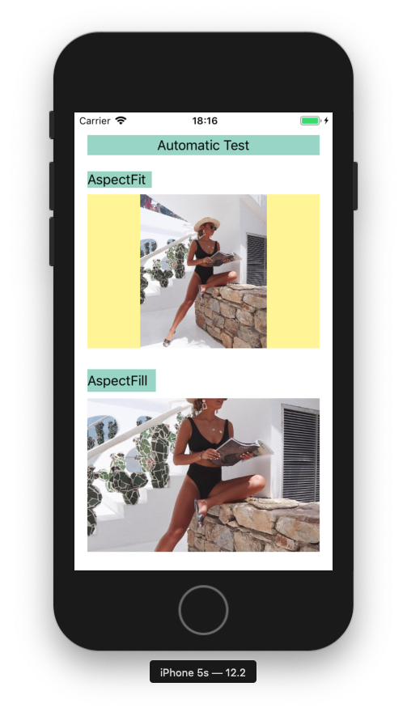

## Table of Contents

- [📖 Introduction to the issue](#introduction-to-the-issue)

- [📚 An enumeration of key technologies](#an-enumeration-of-key-technologies)

- [📈 Test results](#test-results)

- [👀 Interesting facts](#interesting-facts)

- [‼️ Important Features](#important-features)

- [📋 Description of the test project](#description-of-the-test-project)

- [💻 Code Snippets ](#code-snippets)

  - [Objective-c](#objective-c)

    - [UIKit](#uikit-objc)

    - [CoreGraphics](#coregraphics-objc)

    - [ImageIO](#imageio-objc)

    - [CoreImage](#coreimage-objc)

    - [vImage](#vimage-objc)

  - [Swift](#swift)

    - [UIKit](#uikit-swift)

    - [CoreGraphics](#coregraphics-swift)

    - [ImageIO](#imageio-swift)

    - [CoreImage](#coreimage-swift)

    - [vImage](#vimage-swift)

- [📦 Additional materials](#additional-materials)

<br>


## Introduction to the issue
<br>
When you download a picture from the Internet and try to insert it into the `UIImageView` you may encounter the following problem.

To display a picture in an instance of `UIImageView`, the operating system takes the original `UIImage` and compresses it to a rarefaction of `UIImageView`.



During this operation, device performance may decline, from **60FPS** to **15-20FPS**.

So before every developer is duty to independently compress the picture before inserting it in the `UIImageView`.


<br>
<br>
<br>

## An enumeration of key technologies

The compression procedure can be performed by different technologies, there are 5 in total.

**UIKit** <br>
**CoreGraphics** <br>
**ImageIO** <br>
**CoreImage** <br>
**vImage** <br>

This repository contains a project with code for each of the technologies in two languages at once. `Swift`/`Objective-c`.
<br>
<br>

## Test results

Before writing my own test, I read an article on [NSHipter](https://nshipster.com/image-resizing/) about image compression, which also contained Performance Benchmarks.

When I conducted my own tests I noticed that different types of devices can be effective different technologies.

```json
Now the test will be run on device: iPad 2017

Name(Bridge0.4MB) | Size: 0,3 MB | SourceImage: {1920, 1080} | Will converted to: {370, 208}

UIKitObjc                   | AverageTime For : 0.0301
UIKitSwift                  | AverageTime For : 0.0313
CoreGraphicsObjc            | AverageTime For : 0.0064
CoreGraphicsSwift           | AverageTime For : 0.0061
ImageIO_Objc                | AverageTime For : 0.0060
ImageIO_Swift               | AverageTime For : 0.0061
ImageIO_Subsampling_Objc    | AverageTime For : 0.0066
ImageIO_Subsampling_Swift   | AverageTime For : 0.0071
CoreImageObjc               | AverageTime For : 0.0304
CoreImageSwift              | AverageTime For : 0.0293
vImageObjc                  | AverageTime For : 0.0188
vImageSwift                 | AverageTime For : 0.0178
----------------------------------------------------------------------
| The Best Technology: ImageIO_Objc             | Time: 0.0060
----------------------------------------------------------------------
```

## Interesting facts

Also, the performance of the technology is affected by the `size`/`resolution`/`image extension`.

For example, when editing `png` images, resolution in pixels is important, not the size of the occupied memory in megabytes.
**(That is, the first picture can weigh 10 times more than the second, but it can be processed faster because it has a lower resolution in pixels)**.

And for `jpg` pictures, the weight of the image in megabytes is important.
**(That is, the first picture can have a resolution in pixels greater than the second one tens of times and process faster because it has less weight in megabytes)**.


## Important Features

If you want to test technologies with your own pictures, you may notice that the same copy of pictures (with different resolutions) can be processed more efficiently by one technology or another.

I want to **warn** you against writing such conditions in your projects.

```objectivec
if (the picture weighs more than 1.2 Mb){
    Use A technology
} 
else {
    Use technology B

}
```

⛔️  **Please, do not do that.** ⛔️

All such performance tests are very **individual**.
For example, if you notice that an image that weighs more than N-megabytes is better processed using N-technology, it may really be so on some specific type and model of device.

For example, such a division may be effective for the `second-generation iPad Air`, but terribly not effective for the `iPhone 6/6s`.
<br>
<br>

## Description of the test project

The test project contains two controllers.

1. (Controller for manual testing) there each technology is called exactly once.

2. (Controller for automatic testing) there, each technology is called 5 times, after which the average time and the best technology are displayed.


<br>

## Code snippets


### Objective-C

#### UIKit Objc

[Copy code](/Documentation/CodeSnippetsText/objc/uikitobjc.txt)


#### CoreGraphics Objc

[Copy code](/Documentation/CodeSnippetsText/objc/coregraphicsobjc.txt)


#### ImageIO Objc

[Copy code](/Documentation/CodeSnippetsText/objc/imageIOobjc.txt)


#### CoreImage Objc

[Copy code](/Documentation/CodeSnippetsText/objc/coreImageObjc.txt)


#### vImage Objc

[Copy code](/Documentation/CodeSnippetsText/objc/vImageObjc.txt)


---

### Swift

#### UIKit Swift

[Copy code](/Documentation/CodeSnippetsText/swift/uikitswift.txt)


#### CoreGraphics Swift

[Copy code](/Documentation/CodeSnippetsText/swift/coregraphicsswift.txt)


#### ImageIO Swift

[Copy code](/Documentation/CodeSnippetsText/swift/imageIOswift.txt)


#### CoreImage Swift

[Copy code](/Documentation/CodeSnippetsText/swift/coreImageSwift.txt)


#### vImage Swift

[Copy code](/Documentation/CodeSnippetsText/swift/vImageSwift.txt)


<br>

### Additional materials

https://nshipster.com/image-resizing/ <br>

http://vocaro.com/trevor/blog/2009/10/12/resize-a-uiimage-the-right-way/

[🇷🇺 Russian Readme](Readme(RU).md) 
